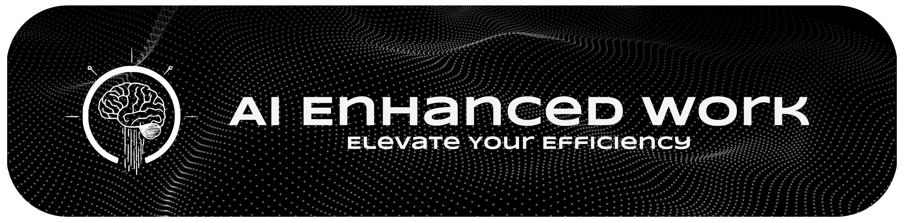

 

 
 

***A curated index of impactful AI tools and models, that emphasizes technical merit, practical utility and Prioritizing open-source.***

**Effective AI use requires understanding capabilities, limitations, and bias mitigation strategies.**

 

 

# Introduction

Navigating the rapidly evolving field of Artificial Intelligence can be overwhelming. This repository serves as a comprehensive, curated guide designed for **developers, data scientists, researchers, students, and AI enthusiasts** seeking practical tools, cutting-edge models, and valuable learning resources.

Our goal is to help you **discover, compare, and select the right AI solutions** for your projects by providing structured information, comparisons, and direct links. We place a strong emphasis on **open-source options** while also including noteworthy proprietary tools.

 

**Understanding the Indicators:**

Throughout this guide, you may see the following indicator:

 The source code is typically not available, and its **use, modification, and distribution are restricted by the vendor.** Access often requires payment or a subscription, and licenses may limit how the software can be deployed or integrated.

 The source code is **publicly available, allowing users to freely use, modify, and distribute the software (or derived versions) under licenses that grant these permissions.** While often free of charge, always verify the specific license terms for compliance, as some licenses have conditions regarding redistribution or derivative works.

 The tool or service is **available at no cost.** Some free offerings may have limitations or be supported by other means (e.g., community support for open-source projects).

 Offers a **basic tier of services free of charge,** with more **advanced features or capabilities available under a paid subscription.**

 Access to the tool or **service requires a one-time purchase or an ongoing subscription.**

 

**LLM Scoring Framework:**

Since benchmarks cannot always be trusted and existing leaderboards typically focus only on one aspect of modern LLMs' capabilities, we chose to develop our own approach. Formerly developed within this repository, the scoring framework is now under development in a dedicated repository.

Our approach aims to cover a wide range of benchmarks, leaderboards, community assessments, and technical specifications, **trying to provide an unbiased estimation of the overall capacities of any public LLM.**

The **Score** column in some tables may display either **Incoming** or **Pending**.

* ***Incoming*** : The score is not yet computed but will be available soon.
* ***Pending*** : The score cannot currently be computed due to a lack of information or benchmarks. It's unclear when it will be available.

 
 

 
    

 
 

 
 

*Explore the sections below via the Table of Contents to find what you need.* 

Documentation: [CC0 License](./LICENSE.md).

**[Contributions](./CONTRIBUTING.md) and suggestions are welcome!**

 

# Table of contents

 

- [AI Tutorials and Learning Resources](https://github.com/LSeu-Open/AIEnhancedWork/blob/main/Docs/Tutorials_and_Learning_Resources.md)
    - [Tutorials](https://github.com/LSeu-Open/AIEnhancedWork/blob/main/Docs/Tutorials_and_Learning_Resources.md#tutorials)
      - [Local tutorials](https://github.com/LSeu-Open/AIEnhancedWork/blob/main/Docs/Tutorials_and_Learning_Resources.md#local-tutorials)
      - [Online tutorials](https://github.com/LSeu-Open/AIEnhancedWork/blob/main/Docs/Tutorials_and_Learning_Resources.md#online-tutorials)
    - [Learning Resources](https://github.com/LSeu-Open/AIEnhancedWork/blob/main/Docs/Tutorials_and_Learning_Resources.md#learning-resources)
      - [Beginner](https://github.com/LSeu-Open/AIEnhancedWork/blob/main/Docs/Tutorials_and_Learning_Resources.md#beginner)
      - [Intermediate](https://github.com/LSeu-Open/AIEnhancedWork/blob/main/Docs/Tutorials_and_Learning_Resources.md#intermediate)
      - [Advanced](https://github.com/LSeu-Open/AIEnhancedWork/blob/main/Docs/Tutorials_and_Learning_Resources.md#advanced)  
- [Audio Processing](https://github.com/LSeu-Open/AIEnhancedWork/blob/main/Docs/Audio_Processing.md)
    - [Transcription and Summarization](https://github.com/LSeu-Open/AIEnhancedWork/blob/main/Docs/Audio_Processing.md#transcription-and-summarization)
    - [Music Generation](https://github.com/LSeu-Open/AIEnhancedWork/blob/main/Docs/Audio_Processing.md#music-generation)
    - [Text-to-Speech Synthesis](https://github.com/LSeu-Open/AIEnhancedWork/blob/main/Docs/Audio_Processing.md#text-to-speech-synthesis)
      - [Text-to-Speech Models](https://github.com/LSeu-Open/AIEnhancedWork/blob/main/Docs/Audio_Processing.md#text-to-speech-models)
      - [Text-to-Speech Providers](https://github.com/LSeu-Open/AIEnhancedWork/blob/main/Docs/Audio_Processing.md#text-to-speech-providers)
    - [Speech Recognition](https://github.com/LSeu-Open/AIEnhancedWork/blob/main/Docs/Audio_Processing.md#speech-recognition)
      - [Speech-to-Text Models](https://github.com/LSeu-Open/AIEnhancedWork/blob/main/Docs/Audio_Processing.md#speech-to-text-models)
      - [Speech-to-Text Providers](https://github.com/LSeu-Open/AIEnhancedWork/blob/main/Docs/Audio_Processing.md#speech-to-text-providers)
    - [Voice Assistants](https://github.com/LSeu-Open/AIEnhancedWork/blob/main/Docs/Audio_Processing.md#voice-assistants)
      - [Voice Assistants Models](https://github.com/LSeu-Open/AIEnhancedWork/blob/main/Docs/Audio_Processing.md#voice-assistants-models)
      - [Voice Assistants Providers](https://github.com/LSeu-Open/AIEnhancedWork/blob/main/Docs/Audio_Processing.md#voice-assistants-providers)
- [Automation](https://github.com/LSeu-Open/AIEnhancedWork/blob/main/Docs/Automation.md)
    - [Autonomous Agents](https://github.com/LSeu-Open/AIEnhancedWork/blob/main/Docs/Automation.md#autonomous-agents)
    - [Automation tools](https://github.com/LSeu-Open/AIEnhancedWork/blob/main/Docs/Automation.md#automation-tools)
- [Coding and Software Development](https://github.com/LSeu-Open/AIEnhancedWork/blob/main/Docs/Coding_and_Software_Development.md)
    - [Coding LLMs](https://github.com/LSeu-Open/AIEnhancedWork/blob/main/Docs/Coding_and_Software_Development.md#coding-llms)
    - [Coding-focused LLM Providers](https://github.com/LSeu-Open/AIEnhancedWork/blob/main/Docs/Coding_and_Software_Development.md#coding-focused-llm-providers)
    - [AI-Augmented Integrated Development Environments](https://github.com/LSeu-Open/AIEnhancedWork/blob/main/Docs/Coding_and_Software_Development.md#ai-augmented-integrated-development-environments)
    - [App Building Tools](https://github.com/LSeu-Open/AIEnhancedWork/blob/main/Docs/Coding_and_Software_Development.md#app-building-tools)
    - [Website Building Tools](https://github.com/LSeu-Open/AIEnhancedWork/blob/main/Docs/Coding_and_Software_Development.md#website-building-tools)
- [Computer Vision](https://github.com/LSeu-Open/AIEnhancedWork/blob/main/Docs/Computer_Vision.md)
    - [Image Editing](https://github.com/LSeu-Open/AIEnhancedWork/blob/main/Docs/Computer_Vision.md#image-editing)
    - [Image Generation](https://github.com/LSeu-Open/AIEnhancedWork/blob/main/Docs/Computer_Vision.md#image-generation)
      - [Image Generation Models](https://github.com/LSeu-Open/AIEnhancedWork/blob/main/Docs/Computer_Vision.md#image-generation-models)
      - [Cloud-based Image Generation Providers](https://github.com/LSeu-Open/AIEnhancedWork/blob/main/Docs/Computer_Vision.md#cloud-based-image-generation-providers)
      - [Local Image Generation Providers](https://github.com/LSeu-Open/AIEnhancedWork/blob/main/Docs/Computer_Vision.md#local-image-generation-providers)
    - [Video Generation](https://github.com/LSeu-Open/AIEnhancedWork/blob/main/Docs/Computer_Vision.md#video-generation)
      - [Image-to-Video Models](https://github.com/LSeu-Open/AIEnhancedWork/blob/main/Docs/Computer_Vision.md#image-to-video-models)
      - [Text-to-Video Models](https://github.com/LSeu-Open/AIEnhancedWork/blob/main/Docs/Computer_Vision.md#text-to-video-models)
      - [Video Generation Providers](https://github.com/LSeu-Open/AIEnhancedWork/blob/main/Docs/Computer_Vision.md#video-generation-providers)
    - [3D Model Generation](https://github.com/LSeu-Open/AIEnhancedWork/blob/main/Docs/Computer_Vision.md#3d-model-generation)
      - [Text/Image-to-3D Models](https://github.com/LSeu-Open/AIEnhancedWork/blob/main/Docs/Computer_Vision.md#textimage-to-3d-models)
- [Data Analysis](https://github.com/LSeu-Open/AIEnhancedWork/blob/main/Docs/Data_Analysis.md)
- [Foundation Models](https://github.com/LSeu-Open/AIEnhancedWork/blob/main/Docs/Foundation_Models.md)
  - [Language Only Large Language Models](https://github.com/LSeu-Open/AIEnhancedWork/blob/main/Docs/Foundation_Models.md#language-only-large-language-models)
    - [Advanced Language and Reasoning LLMs](https://github.com/LSeu-Open/AIEnhancedWork/blob/main/Docs/Foundation_Models.md#advanced-language-and-reasoning-llms)
      - [Open source Models](https://github.com/LSeu-Open/AIEnhancedWork/blob/main/Docs/Foundation_Models.md#open-source-models)
      - [Proprietary Models](https://github.com/LSeu-Open/AIEnhancedWork/blob/main/Docs/Foundation_Models.md#proprietary-models)
    - [Finetuned LLMs](https://github.com/LSeu-Open/AIEnhancedWork/blob/main/Docs/Foundation_Models.md#finetuned-llms)
      - [Astrophysics](https://github.com/LSeu-Open/AIEnhancedWork/blob/main/Docs/Foundation_Models.md#astrophysics)
      - [Function calling](https://github.com/LSeu-Open/AIEnhancedWork/blob/main/Docs/Foundation_Models.md#function-calling)
      - [Math](https://github.com/LSeu-Open/AIEnhancedWork/blob/main/Docs/Foundation_Models.md#math)
      - [Role Play](https://github.com/LSeu-Open/AIEnhancedWork/blob/main/Docs/Foundation_Models.md#role-play)
      - [Uncensored](https://github.com/LSeu-Open/AIEnhancedWork/blob/main/Docs/Foundation_Models.md#uncensored)
    - [LLM Providers](https://github.com/LSeu-Open/AIEnhancedWork/blob/main/Docs/Foundation_Models.md#llm-providers)
      - [Cloud-based LLM Providers](https://github.com/LSeu-Open/AIEnhancedWork/blob/main/Docs/Foundation_Models.md#cloud-based-llm-providers)
      - [Local LLM Providers](https://github.com/LSeu-Open/AIEnhancedWork/blob/main/Docs/Foundation_Models.md#local-llm-providers)
      - [LLM Inference Engines](https://github.com/LSeu-Open/AIEnhancedWork/blob/main/Docs/Foundation_Models.md#llm-inference-engines)
  - [Multimodal Foundation Models](https://github.com/LSeu-Open/AIEnhancedWork/blob/main/Docs/Foundation_Models.md#multimodal-foundation-models) 
    - [Vision Language Models](https://github.com/LSeu-Open/AIEnhancedWork/blob/main/Docs/Foundation_Models.md#vision-language-models)
      - [Open source VLMs](https://github.com/LSeu-Open/AIEnhancedWork/blob/main/Docs/Foundation_Models.md#open-source-vlms)
      - [Proprietary VLMs](https://github.com/LSeu-Open/AIEnhancedWork/blob/main/Docs/Foundation_Models.md#proprietary-vlms)
    - [Multimodal Large Language Models](https://github.com/LSeu-Open/AIEnhancedWork/blob/main/Docs/Foundation_Models.md#multimodal-large-language-models)
      - [Open-Source MLLMs](https://github.com/LSeu-Open/AIEnhancedWork/blob/main/Docs/Foundation_Models.md#open-source-mllms)
      - [Proprietary MLLMs](https://github.com/LSeu-Open/AIEnhancedWork/blob/main/Docs/Foundation_Models.md#proprietary-mllms)
- [Search and Research Tools](https://github.com/LSeu-Open/AIEnhancedWork/blob/main/Docs/Search_and_Research_Tools.md)
    - [Academic and Scientific Research](https://github.com/LSeu-Open/AIEnhancedWork/blob/main/Docs/Search_and_Research_Tools.md#academic-and-scientific-research)
    - [AI-Powered Web Browsers](https://github.com/LSeu-Open/AIEnhancedWork/blob/main/Docs/Search_and_Research_Tools.md#ai-powered-web-browsers)
    - [Deep Research Tools](https://github.com/LSeu-Open/AIEnhancedWork/blob/main/Docs/Search_and_Research_Tools.md#deep-research-tools)
    - [Search Engines](https://github.com/LSeu-Open/AIEnhancedWork/blob/main/Docs/Search_and_Research_Tools.md#search-engines)
- [Other Applications](https://github.com/LSeu-Open/AIEnhancedWork/blob/main/Docs/Other_Applications.md)
    - [Language Learning Tools](https://github.com/LSeu-Open/AIEnhancedWork/blob/main/Docs/Other_Applications.md#language-learning-tools)
    - [Meeting Transcription and Summarization](https://github.com/LSeu-Open/AIEnhancedWork/blob/main/Docs/Other_Applications.md#meeting-transcription-and-summarization)
    - [Presentation Slides Generation](https://github.com/LSeu-Open/AIEnhancedWork/blob/main/Docs/Other_Applications.md#presentation-slides-generation)
    - [Versatile Productivity Tools](https://github.com/LSeu-Open/AIEnhancedWork/blob/main/Docs/Other_Applications.md#versatile-productivity-tools)
   
 
 

<h3 align="center">  We welcome community contributions through pull requests and issue discussions. </h3>
<h4 align="center">  A  to AIEnhancedWork is must as a motivation booster. </h4>

[⬆️ Back to Top](#introduction)

