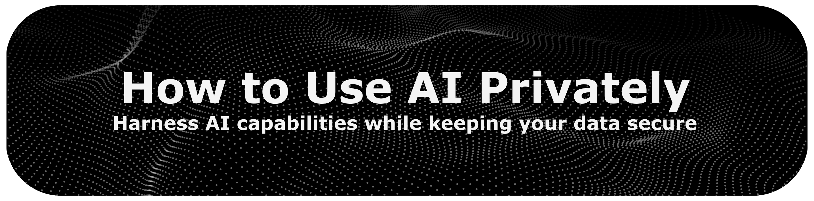

<!-- last-reviewed: 2026-06 -->

 
 

This guide explains how AI providers use your data, why it matters, and the
concrete tools and settings that let you use AI while keeping your data private.

Reading time: ~15 min

 

[Back to the main index](../README.md)

 

# How to Use AI Privately

## Table of Contents

- [Introduction](#introduction)
- [How Your Data is Used by AI Providers](#how-your-data-is-used-by-ai-providers)
- [Why It Matters](#why-it-matters)
- [Handling Your Data When Using AI](#handling-your-data-when-using-ai)
  - [Practical Privacy Levers](#practical-privacy-levers)
- [Private Ways to Use LLMs](#private-ways-to-use-llms)
  - [Run LLMs on Your Machine](#run-llms-on-your-machine)
  - [Duck.ai](#duckai)
  - [Proton Lumo](#proton-lumo)
- [Choosing Your Approach](#choosing-your-approach)

 

## Introduction

AI tools rely on large amounts of data to function, and much of that data is
yours: your prompts, the files you upload, and how you use the service. Privacy
here is not about secrecy; it is about keeping control over your information and
knowing how it is used.

That control matters for several reasons:

1. **Personal security**: limiting where your data goes reduces exposure to identity theft, fraud, and leaks.
2. **Trust and transparency**: you should be able to know how a service handles your data.
3. **Legal compliance**: regulations such as the GDPR in Europe set requirements for how organizations process personal data.
4. **Ethics**: respecting privacy is a basic principle that protects individual rights.

To go deeper, Neil Richards' book [Why Privacy Matters](https://global.oup.com/academic/product/why-privacy-matters-9780190939045?cc=us&lang=en&)
is a thorough introduction. For practical starting points:

* [Privacy Guides](https://www.privacyguides.org/en/) — approachable, for non-technical users.
* [Awesome Privacy (pluja)](https://github.com/pluja/awesome-privacy) and [Awesome Privacy (lissy93)](https://github.com/Lissy93/awesome-privacy) — large lists of privacy-focused tools.
* [Personal Security Checklist](https://github.com/Lissy93/personal-security-checklist/blob/HEAD/CHECKLIST.md) — basic-to-advanced steps to protect your devices and accounts.

 

## How Your Data is Used by AI Providers

When you use a hosted AI service, your information typically moves through three
stages:

1. **Processing**: your input goes to the provider's servers to answer your request.
2. **Storage**: it may be retained to monitor usage, debug, and improve the service.
3. **Reuse**: depending on the provider and your settings, it may be used to train future models or shared with partners.

 

*How user data can flow through an AI provider.*

 

Providers use this data in two main ways. The first is **personalization**: your
interactions help tailor responses to you. The second is **model and product
improvement**: aggregated data from many users informs research, new features,
and performance tuning. Whether *your* data is used for training depends on the
provider, the tier you use, and your account settings — which is exactly what the
rest of this guide helps you control.

 

## Why It Matters

Using a hosted AI service exposes your data to several risks, and you often have
limited visibility into how it is handled:

* **Hidden collection**: services may log more than your direct inputs, including usage patterns and the edits you make to their suggestions.
* **Breach risk**: large stores of user data are attractive targets, and a single breach can expose many users at once.
* **Profiling**: behavioral data can be combined into a detailed profile of how and when you work.
* **Re-identification**: "anonymized" data can sometimes be linked back to an individual by combining data points.
* **Weak legal guarantees**: privacy law lags behind AI, so compliance today does not guarantee your data won't be used in unexpected ways tomorrow.
* **Data as an asset**: inputs can be treated as a commercial asset — shared, sold as insights, or used to build new products — often without clear disclosure.

 

## Handling Your Data When Using AI

A few habits go a long way:

* **Read the privacy policy** before you commit to a service. Check what is collected, how long it is retained, whether it is used for training, and how to opt out.
* **Prefer transparent or local-first tools**. Open-source and on-device options keep your data under your control; for cloud services, choose ones with clear, strong privacy commitments.
* **Share only what's needed**. Don't paste secrets, credentials, or personal details unless the task truly requires them, and separate personal from professional use.
* **Use strong account security**: HTTPS, up-to-date software, a password manager, and two-factor authentication.
* **Review regularly**. Re-check app permissions and privacy settings periodically, and revoke access you no longer need.

### Practical Privacy Levers

Beyond general habits, these concrete settings have the biggest impact on whether
your data is retained or used for training:

* **Turn off training in consumer apps.** ChatGPT, Claude, Gemini, and Copilot all have a setting to exclude your conversations from model training. It is often on by default on free consumer tiers, so check it.
* **Use temporary / incognito chats.** Features like ChatGPT's Temporary Chat aren't saved to your history and aren't used for training — useful for sensitive one-off questions.
* **Prefer the API or Team/Enterprise tiers.** By default, the major providers (OpenAI, Anthropic, Google) do **not** train on data sent through their APIs, and their Team/Enterprise plans contractually exclude training. If you have the option, these are more private than free consumer apps.
* **Remember that "no training" is not "no logging."** Even when training is disabled, providers may retain data for a limited period to monitor abuse. For the strongest guarantees, run locally or use a provider built around zero-retention.

 

## Private Ways to Use LLMs

### Run LLMs on Your Machine

Running a model on your own hardware is the most private option: your data never
leaves your computer, and you have full control over which model you use and how.
The trade-off is that capable models need capable hardware, and there is some
setup involved.

A step-by-step guide is in our dedicated tutorial:
[How to Run LLMs on Your Machine](how-to-run-llms-on-your-machine.md).

### Duck.ai

[Duck.ai](https://duck.ai/) is a free, anonymous AI chat from DuckDuckGo. It
requires no account, removes identifying metadata (such as your IP address)
before forwarding your prompt, and stores recent chats **locally on your device**.
DuckDuckGo has agreements with the underlying providers that prohibit them from
using your prompts to train their models.

* **Models**: a selection of hosted models from Anthropic, Meta, Mistral, and OpenAI (including open-weight options), available for free.
* **Notable**: no sign-up, anonymized requests, local chat history, and a voice mode.
* **Best for**: quick, anonymous access to capable models with zero setup. See its [privacy details](https://duckduckgo.com/duckduckgo-help-pages/duckai/ai-chat-privacy).

### Proton Lumo

[Proton Lumo](https://proton.me/lumo) is a privacy-first assistant from Proton
(the maker of Proton Mail). It keeps **no logs** of your prompts or replies, and
saved conversations use zero-access encryption, so they can only be decrypted on
your device. Lumo is **fully open-source** and never uses your data to train its
models, which are open-weight models run on Proton-controlled servers.

* **Models**: open-weight models (such as GPT-OSS, Qwen, and Kimi K2) hosted by Proton.
* **Notable**: zero-access encrypted chat history, open-source code, encrypted "Projects" for grouping files and chats, and a free tier with a paid Lumo Plus upgrade.
* **Best for**: a confidential, account-based assistant from an established privacy company. See its [security model](https://proton.me/blog/lumo-security-model).

 

## Choosing Your Approach

The right choice depends on your priorities, hardware, and how much setup you'll
accept:

* **Maximum privacy and control** → **run locally**. Your data never leaves your machine and you can use any compatible open-source model, at the cost of needing capable hardware and some setup. See the [hardware guidance](how-to-run-llms-on-your-machine.md#find-the-model-that-is-right-for-you).
* **Anonymous, zero-setup access** → **Duck.ai**. Free and account-free, with capable hosted models and no training on your prompts. The trade-off is trusting DuckDuckGo's anonymization.
* **A confidential, persistent assistant** → **Proton Lumo**. Encrypted, open-source, and account-based, with synced history. The trade-off is trusting Proton's implementation.
* **Hosted models in general** → use the **practical privacy levers** above (API or Enterprise tiers, training turned off, temporary chats) to reduce what's retained.

 

[Back to top](#table-of-contents)

 
