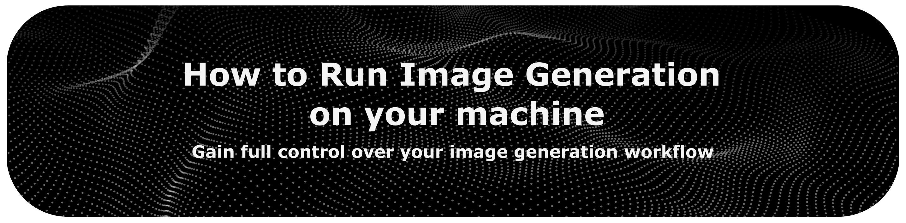

<!-- last-reviewed: 2026-06 -->
<div align="center">



<br>
<br>

This guide explains how to set up and run image-generation models on your own
computer, so you keep full control over your AI image workflows.

Reading time: ~25 min

<br>

[Back to the main index](../README.md)

</div>

<br>

# How to Run Image Generation on Your Machine

## Table of Contents

- [Introduction](#introduction)
- [Hardware Requirements](#hardware-requirements)
- [Find the Model that is Right for You](#find-the-model-that-is-right-for-you)
  - [Models to Start With](#models-to-start-with)
  - [Where to Find Models](#where-to-find-models)
  - [Understanding the Different Model Files](#understanding-the-different-model-files)
- [SwarmUI (Beginner)](#swarmui-beginner)
- [Forge Neo (Intermediate)](#forge-neo-intermediate)
- [ComfyUI (Expert)](#comfyui-expert)

<br>

## Introduction

Running image-generation models on your own computer gives you control and
privacy: your prompts and images stay on your machine, there are no usage caps
or content filters imposed by a service, and you can freely combine models,
styles, and parameters.

This guide covers three interfaces, from the simplest to the most flexible:

* **SwarmUI** — an easy, modern interface with a one-click installer; a good starting point that still supports the latest models.
* **Forge Neo** — a feature-rich, A1111-style web UI for users who want more control and extensions.
* **ComfyUI** — a node-based system offering maximum flexibility for complex workflows.

> [!NOTE]
> Two once-popular tools, **Fooocus** and **AUTOMATIC1111 (A1111)**, are no
> longer actively developed (both paused around mid-2024 and are limited to
> older SDXL-era models). They still work, but for current models (Flux, Qwen,
> SD 3.5) the tools above are the maintained successors — Forge Neo in
> particular is the direct continuation of the A1111/Forge line.

<br>

## Hardware Requirements

A dedicated GPU is strongly recommended. The table below is a rough guide; newer
models such as Flux and Qwen-Image need more VRAM than the older SDXL models.

| OS | GPU | Min VRAM | Min RAM | Notes |
| :-- | :-- | :-- | :-- | :-- |
| Windows / Linux | NVIDIA RTX (any gen) | 6-8GB (SDXL); 12GB+ for Flux / Qwen | 16GB | Best supported. Newer is faster (50xx > 40xx > 30xx > 20xx). |
| Windows / Linux | NVIDIA GTX (10/16 series) | 8GB | 16GB | Works for SDXL but slow; limited or no support for the newest models. |
| Windows | AMD Radeon | 8-12GB | 16GB | Via ZLUDA or DirectML; slower than comparable NVIDIA. ROCm-on-Windows support is improving. |
| Linux | AMD Radeon | 8-12GB | 16GB | Via ROCm; faster than AMD on Windows, but still behind comparable NVIDIA. |
| macOS | Apple Silicon (M1-M4) | 16GB+ unified | Shared | Works via Metal; slower than mid/high-end NVIDIA. More unified memory helps with Flux/Qwen. |
| Windows / Linux / macOS | CPU only | N/A | 32GB | Very slow; fine only for occasional use. |

> [!TIP]
> If a model is too large for your VRAM, look for a **GGUF / quantized** version
> (common for Flux and Qwen-Image). These trade a little quality for much lower
> memory use, so a Flux-class model can run on an 8GB card.

<br>

## Find the Model that is Right for You

Choosing the right model is the biggest factor in the results you get.

### Models to Start With

* **[Flux.1 \[dev\]](https://huggingface.co/black-forest-labs/FLUX.1-dev)** and **[Flux.2 \[dev\]](https://huggingface.co/black-forest-labs/FLUX.2-dev)** — top-tier photorealism and prompt-following; Flux.2 adds higher resolution and multi-reference consistency.
* **[Qwen-Image](https://huggingface.co/Qwen/Qwen-Image)** — excellent prompt adherence and (notably) accurate text rendering; Apache-licensed.
* **[Stable Diffusion 3.5 Large](https://huggingface.co/stabilityai/stable-diffusion-3.5-large)** — a mature, well-supported ecosystem with broad ControlNet and tooling.
* **[Stable Diffusion XL (SDXL)](https://civitai.com/models/101055/sd-xl)** — lighter on VRAM, with a huge library of community fine-tunes (Juggernaut XL, RealVisXL); a good default if your hardware is modest.
* **Anime / illustration**: **[Illustrious XL](https://civitai.com/models/1224788/prefect-illustrious-xl)**, **[NoobAI-XL](https://civitai.com/models/833294/noobai-xl-nai-xl)**, and **[Pony Diffusion V6 XL](https://civitai.com/models/257749/pony-diffusion-v6-xl)**.

### Where to Find Models

* [**Hugging Face**](https://huggingface.co/models?pipeline_tag=text-to-image&sort=trending): the main hub for official base models (Flux, SD 3.5, Qwen-Image) and research models. Search for text-to-image models.
* [**Civitai**](https://civitai.com/): the largest community site for fine-tuned checkpoints, LoRAs, embeddings, and VAEs, with example images and reviews. Content can be NSFW — use the filters, and check each model's license.
* [**OpenModelDB**](https://openmodeldb.info/): a database focused on upscaling models (ESRGAN and others).

### Understanding the Different Model Files

The ecosystem uses several types of files that work together.

**1. Checkpoints / Base Models (`.safetensors`, sometimes `.ckpt`)**

* **What they are**: the large, foundational models (often several gigabytes) that hold the core knowledge and style. Think of them as the "brain."
* **Purpose**: switching checkpoints is the main way to change overall style and capability (photorealistic, anime, etc.).
* **Architectures**: common bases include SDXL, SD 3.5, Flux, and Qwen-Image. Many popular checkpoints are fine-tunes of these (e.g., Juggernaut XL, DreamShaper).

**2. Modifiers and Fine-tuners**

* **LoRAs (Low-Rank Adaptations) (`.safetensors`)**: small files (megabytes) that apply targeted adjustments — a style, character, object, or pose — without a whole new checkpoint. You can stack several and weight each one.
* **Embeddings / Textual Inversions (`.pt` or `.safetensors`)**: tiny files that teach the model a new trigger word for a specific concept. More focused than LoRAs and activated by their trigger word in the prompt.

**3. Utility Models**

* **VAEs (Variational Auto-Encoders) (`.safetensors` or `.pt`)**: convert between the model's internal "latent" representation and actual pixels. Most checkpoints include a VAE, but swapping it can change colors, saturation, and fine detail.
* **Upscaling Models (`.pth` or `.safetensors`)**: increase resolution while adding or preserving detail (ESRGAN, SwinIR, 4x-UltraSharp). Used in post-processing or inside a workflow.
* **ControlNet Models (`.safetensors`)**: condition generation on an input image or map (depth, pose, edges), giving precise control over composition. Require specific software support (extensions in Forge, nodes in ComfyUI).

<br>

## SwarmUI (Beginner)

[SwarmUI](https://github.com/mcmonkeyprojects/SwarmUI) is an open-source (MIT)
interface that pairs an easy "Generate" tab with a powerful ComfyUI backend. It
installs in a few clicks, supports the latest models (Flux, Qwen-Image, SD 3.5,
and even video models), and grows with you — when you're ready, the same tool
exposes a full node workflow.

### Installation

1. Install the prerequisites if you don't have them: [Git](https://git-scm.com/downloads) and [.NET 8 SDK](https://dotnet.microsoft.com/download/dotnet/8.0) (the installer will prompt you if anything is missing).
2. Download the latest release from the [SwarmUI repository](https://github.com/mcmonkeyprojects/SwarmUI/releases) and extract it.
3. Run **`install-windows.bat`** (Windows) or **`install-linuxmac.sh`** (Linux/macOS). It downloads dependencies and ComfyUI automatically.
4. A browser opens to a setup wizard: pick your GPU type, accept the license, and optionally let it download a starter model.
5. When setup finishes, SwarmUI runs at `http://localhost:7801`. Launch it later with `launch-windows.bat` (or the equivalent script).

### Generating Your First Image

The **Generate** tab is the default view:

1. **Model**: pick a checkpoint from the model browser on the left (it shows the models you've downloaded).
2. **Prompt**: type a detailed description in the prompt box — for example, *"a photorealistic portrait of an astronaut cat in a vibrant alien jungle, detailed fur, glowing plants."*
3. **Negative prompt**: list things to avoid (e.g., *"blurry, deformed, extra limbs, watermark, text"*). Note that some newer models (such as Flux) ignore negative prompts by design.
4. **Parameters** (right side): set the **resolution** (use 1024x1024 for SDXL/SD 3.5, higher for Flux), **images** (how many to generate), **steps**, **CFG scale**, and **seed** (-1 for random).
5. Click **Generate**. Results appear in the central view and are saved to your output folder.

### Adding Models

Place downloaded files in SwarmUI's `Models` subfolders — checkpoints in
`Models/Stable-Diffusion/`, LoRAs in `Models/Lora/`, VAEs in `Models/VAE/`, and
so on — or point SwarmUI at an existing models folder under **Server → Server
Configuration**. Use the refresh button in the model browser to pick up new files.

### Image-to-Image and Inpainting

* **Image-to-image**: open the **Init Image** section, upload a source image, and set **Init Image Creativity** (low keeps the original closely; high lets the model change more).
* **Inpainting**: use the built-in image editor to mask an area, then prompt for what should appear there.

### Going Further

SwarmUI's **Comfy Workflow** tab exposes the full ComfyUI node graph, so you can
move from simple generation to advanced, custom pipelines without switching tools.
The **Grid Generator** is useful for comparing prompts, models, or settings side
by side.

> [!TIP]
> Prefer a polished, canvas-based app instead? [InvokeAI](https://github.com/invoke-ai/InvokeAI)
> is another beginner-friendly open-source option with a strong unified canvas
> for inpainting and outpainting.

<br>

## Forge Neo (Intermediate)

[Forge Neo](https://github.com/Haoming02/sd-webui-forge-classic/tree/neo) is the
actively maintained continuation of the A1111 / Forge web UI line. It keeps the
familiar AUTOMATIC1111 interface but is faster, uses less VRAM, and supports
modern models (Flux, Qwen-Image, Lumina, Chroma, and more). If you've used A1111,
you'll feel at home immediately.

> [!NOTE]
> To stay lean and fast, Forge Neo removes some older A1111 features — SD2/SD3
> support, hypernetworks, textual-inversion training, the CLIP/Deepbooru
> interrogators, and many built-in scripts. Generation, img2img, upscaling,
> ControlNet, and LoRAs all remain.

### Installation

You'll need [Git](https://git-scm.com/download/win) and Python (the project
recommends a recent version; check the repository README).

1. Open a terminal in your install directory and clone the **neo** branch:

   ```bash
   git clone https://github.com/Haoming02/sd-webui-forge-classic sd-webui-forge-neo --branch neo
   ```

2. Add a checkpoint: download a model (for example an SDXL or Flux `.safetensors`) and place it in `sd-webui-forge-neo/models/Stable-diffusion/`.
3. Launch with **`webui-user.bat`** (Windows). The first run installs dependencies automatically, then opens the UI at `http://127.0.0.1:7860`.

> [!TIP]
> You can switch to a dark theme by adding `?__theme=dark` to the URL
> (`http://127.0.0.1:7860/?__theme=dark`), or set it permanently in **Settings**.

### Interface Overview

The top row holds the **checkpoint selector** and the main tabs: `txt2img`,
`img2img`, `Extras`, `PNG Info`, `Settings`, and `Extensions`. The generation
view has the prompt and negative-prompt boxes, the parameter controls, the
**Generate** button, and the output gallery.

### Text-to-Image (`txt2img`)

1. **Select a checkpoint** from the dropdown (use the refresh button after adding new models).
2. **Prompt**: describe the image. You can weight terms with parentheses — `(word)` ≈ 1.1×, `(word:1.5)` for an explicit weight, `[word]` to reduce emphasis.
   * Example: `masterpiece, best quality, a majestic lion king on a throne in a futuristic neon city, cinematic lighting`
3. **Negative prompt**: list what to exclude, e.g. `(worst quality, low quality:1.4), blurry, deformed, watermark, text, extra limbs`.
4. **Dimensions**: 1024x1024 (or similar) for SDXL/SD 3.5 and Flux; 512x768 for older SD 1.5 models.
5. **Batch count / batch size**: total images = count × size.
6. Click **Generate**.

**Key parameters**

* **Sampling method**: e.g. `DPM++ 2M Karras` (high quality), `Euler a` (creative), `UniPC` (fast). Flux models use their own recommended samplers.
* **Sampling steps**: 20-30 is usually enough; more steps add detail with diminishing returns.
* **CFG scale**: how strictly the model follows the prompt. 5-8 is a typical range; very high values can look "burnt."
* **Seed**: `-1` for random; reuse a specific seed (with the same settings) to reproduce an image exactly.
* **Hires. fix**: renders small, then upscales in a second pass with an upscaler (e.g. `R-ESRGAN 4x+`). Control how much it changes the image with **denoising strength** (0.3-0.7 is common).

### Image-to-Image (`img2img`)

Upload a source image and prompt for changes. The crucial control is **denoising
strength**:

* `0.0-0.3`: minor changes, preserves the original closely.
* `0.4-0.7`: a good balance for style transfer and larger edits.
* `0.7-1.0`: major changes; the original may become unrecognizable.

The `img2img` tab also includes **Inpaint** (mask an area and prompt for new
content), **Sketch**, and **Batch** processing.

### Useful Tabs and Extensions

* **Extras**: upscale images (`R-ESRGAN 4x+`, `SwinIR`) and run face restoration.
* **PNG Info**: drop in an image generated by Forge/A1111 to read its embedded parameters, then send them straight to `txt2img`/`img2img`.
* **Settings**: themes, save options, and performance optimizations.
* **Extensions**: install community add-ons by URL. **ControlNet** (precise control via pose/depth/edge maps) is the most important one; in Forge Neo its units are organized as tabs.

### Tips

* Start simple, then iterate: generate, observe, adjust the prompt and settings, repeat.
* Use negative prompts to clean up common artifacts.
* Study prompts from images you like (e.g. on Civitai) to learn how others structure them.
* Use LoRAs by typing `<lora:filename:weight>` in the prompt; place LoRA files in `models/Lora`.

<br>

## ComfyUI (Expert)

[ComfyUI](https://github.com/comfyanonymous/ComfyUI) is a node-based interface
that gives you full control over every step of generation. Instead of fixed
panels, you build a workflow by connecting nodes on a canvas. It is the
fastest-moving tool in this space and is usually the first to support new models
(Flux, Qwen-Image, SD 3.5, and video). All computation runs locally.

### Installation

* **ComfyUI Desktop (recommended)**: a standard installer for Windows and macOS that bundles everything and updates itself. The simplest way to start.
* **Portable (Windows)**: download the portable package from the [repository](https://github.com/comfyanonymous/ComfyUI), unzip it, and run `run_nvidia_gpu.bat` or `run_cpu.bat`.
* **Manual** (most control):

  ```bash
  git clone https://github.com/comfyanonymous/ComfyUI.git
  ```

  Then install the requirements and run `python main.py`. See the repository README for the exact, current commands and GPU-specific instructions.

Recommended hardware for the manual/portable route: an NVIDIA GPU with 6GB+ VRAM (more for Flux), 16GB+ RAM (32GB for complex tasks), and ~10GB free disk space.

### The Interface

* **Canvas**: the central area where you build workflows.
* **Toolbar / menu**: load, save, and clear workflows, and queue prompts.
* **Queue**: shows pending and running generations.
* Navigation: mouse-wheel to zoom, middle-mouse to pan, right-click for the node menu.

### Model Placement

Place models in the matching subfolders of your `ComfyUI/models/` directory:

* Checkpoints → `models/checkpoints/`
* LoRAs → `models/loras/`
* VAEs → `models/vae/`
* CLIP / text encoders → `models/clip/`
* Embeddings → `models/embeddings/`
* ControlNet → `models/controlnet/`
* Upscale models → `models/upscale_models/`

Refresh (or restart) ComfyUI after adding files. Some custom nodes expect models in their own locations — check their docs.

### Basic Text-to-Image Workflow

A new install loads a default text-to-image graph. The core nodes are:

1. **Load Checkpoint** — select your model; it outputs `MODEL`, `CLIP`, and `VAE`.
2. **CLIP Text Encode** (×2) — one for the positive prompt, one for the negative; connect each to the `CLIP` output.
3. **Empty Latent Image** — sets the canvas size (e.g. 1024×1024) and batch size.
4. **KSampler** — connect `model`, `positive`, `negative`, and `latent_image`. Set **seed**, **steps** (20-30), **cfg** (try 7), **sampler_name**, and **scheduler**.
5. **VAE Decode** — connect the KSampler `LATENT` output and the checkpoint's `VAE`.
6. **Save Image** — connect the decoded `IMAGE`.

Press **Queue Prompt** (or `Ctrl+Enter`) to run it.

> [!NOTE]
> Newer models such as Flux and Qwen-Image use slightly different node graphs
> (separate text-encoder/UNet/VAE files and dedicated loader nodes). The easiest
> way to start is to load an official template from **Workflow → Browse Templates**.

### Image-to-Image Workflow

<div align="center">


</div>

<br>

1. Set up the model and prompts as above.
2. Add **Load Image** for your source image.
3. Add **VAE Encode** and connect the image and the checkpoint's `VAE` (this converts the image into latent space).
4. Feed that latent into **KSampler**, and set **denoise** below 1.0 (≈0.6-0.8) to keep some of the original — lower values stay closer to the source.
5. Finish with **VAE Decode** and **Save Image**.

### Inpainting Workflow

1. Load the model and prompts.
2. Add **Load Image** and provide a mask (black = keep, white = repaint).
3. Add **VAE Encode**, then **Set Latent Noise Mask** (connect the latent and the mask).
4. Feed it to **KSampler** with a denoise of ≈0.5-0.8.
5. Finish with **VAE Decode** and **Save Image**.

### Upscaling

ComfyUI offers several approaches:

* **Pixel upscaling**: an **Upscale Image By** node — fast, but adds no real detail.
* **Latent upscaling**: a **Latent Upscale** node followed by a second **KSampler** pass (denoise < 1.0) — can add detail, but may alter the image slightly.
* **Model upscaling**: load a dedicated upscaling model (ESRGAN and similar) and apply it — usually the best quality.

<div align="center">


</div>

<br>

### ControlNet

For precise control from a pose, depth map, or edges:

1. Add a **Load ControlNet Model** node and pick the model (e.g. `openpose`, `canny`, `depth`).
2. Add the matching preprocessor node.
3. Connect your input image → preprocessor → **Apply ControlNet**, placing **Apply ControlNet** between your conditioning and the KSampler.

Common types: OpenPose (poses), Canny/Lineart (edges), Depth, Scribble (sketches), and Segmentation.

### ComfyUI Manager

[ComfyUI Manager](https://github.com/Comfy-Org/ComfyUI-Manager) makes installing
and updating custom nodes painless (it's bundled with ComfyUI Desktop). For
portable/manual installs, clone it into `ComfyUI/custom_nodes/` and restart. It
can install nodes, update them, and fetch the models a workflow requires.

### Tips and Shortcuts

* **Queue**: `Ctrl+Enter`. **Bypass a node**: `Ctrl+M`. **Copy/paste**: `Ctrl+C` / `Ctrl+V`.
* ComfyUI embeds the full workflow in the metadata of generated PNGs — drag an image back onto the canvas to restore its workflow.
* Browse the official [ComfyUI Examples](https://github.com/comfyanonymous/ComfyUI_examples) for ready-made workflows you can drag in and adapt.
* Fix a seed while building long node chains to avoid re-rolling on every change.

<br>

<div align="center">

[Back to top](#table-of-contents)

</div>

<br>
