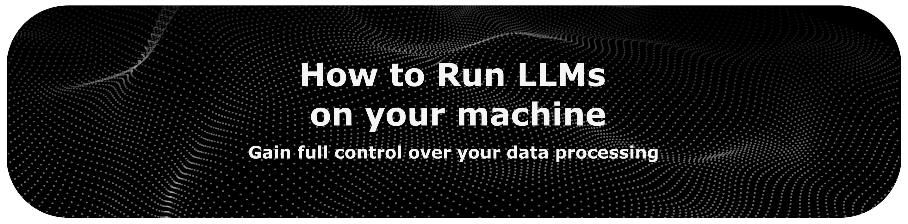

<!-- last-reviewed: 2026-06 -->
<div align="center">



<br>
<br>

This guide explains how to set up and run large language models on your own
computer, so you keep full control over your data and your tools.

Reading time: ~20 min

<br>

[Back to the main index](../README.md)

</div>

## Table of Contents

* [Introduction](#introduction)
* [Find the Model that is Right for You](#find-the-model-that-is-right-for-you)
* [LM Studio (Beginner)](#lm-studio)
* [LocalAI (Intermediate)](#localai)
* [Llama.cpp (Expert)](#llamacpp)

<br>

## Introduction

This tutorial is for anyone who wants more control and transparency over how
their data is processed by running a Large Language Model (LLM) locally. It
covers three tools, from the simplest to the most advanced:

* **LM Studio** — a graphical app, the easiest place to start.
* **LocalAI** — an open-source local runtime with an OpenAI-compatible API.
* **Llama.cpp** — the low-level engine most of these tools are built on.

#### Trade-offs of cloud-based AI services

* **Privacy**: your data is sent to remote servers, and you have limited visibility into who can access it and how it is retained.
* **Transparency**: you cannot inspect how a hosted model processes your input or why it produces a given output.
* **Security**: large providers concentrate huge amounts of user data, which makes them high-value targets for breaches.

#### What running LLMs locally gives you

* **Data control**: your input stays on your machine and is not shared with third parties.
* **Offline use**: no network round-trip, so the model keeps working without an internet connection.
* **Simpler compliance**: you decide where data is stored and processed, which makes privacy requirements easier to meet.

<br>

## Find the Model that is Right for You

Before installing anything, it helps to know which model your hardware can
actually run.

The estimates below assume models are **quantized** to a common 4-bit format,
which reduces size and memory use while keeping most of the quality. Actual
performance varies with the software, the model architecture, and your system.
You can learn more about quantization in [this overview](https://huggingface.co/blog/merve/quantization),
and how to pick a quantization level in our own tutorial: [How to Select the Right Quantized Model](how-to-select-the-right-quantized-model.md).

> [!IMPORTANT]
> You can **run models without a GPU**: the model is loaded into system RAM
> and inference runs on the CPU. This works, but it is much slower than
> running on a GPU or on a machine with fast unified memory.

To compare models on a specific task, use a current leaderboard rather than a
fixed list. For coding, the [Aider polyglot coding leaderboard](https://aider.chat/docs/leaderboards/)
benchmarks LLMs across multiple languages; for general capability, see the
leaderboards linked from our [Foundation Models](../Docs/Foundation_Models.md#advanced-language-and-reasoning-llms) page.

### Estimating hardware needs

The full model list is maintained in the
[Foundation Models](../Docs/Foundation_Models.md#language-only-large-language-models)
page. Here is a general guide to estimate the memory you need, based on model
size at 4-bit quantization:

| Model size (parameters, approx. Q4) | Estimated VRAM / memory | Typical hardware |
|-------------------------------------|-------------------------|------------------|
| > 100B (very large)                 | 64GB - 400GB+           | Multiple data-center GPUs (NVIDIA H100/H200/B200) or a high-capacity unified-memory machine; often run in the cloud |
| ~50B - 100B (large)                 | 32GB - 64GB+            | 1-2 high-end GPUs (RTX 5090, A100) or 64GB+ of unified memory (Apple Silicon, AMD Ryzen AI Max) |
| ~15B - 50B (medium)                 | 16GB - 40GB             | Single high-end consumer GPU (RTX 4090 / 5080 / 5090) or 32GB+ of unified memory |
| ~7B - 15B (small-medium)            | 8GB - 16GB              | Mid-to-high range consumer GPU (RTX 4070 / 5070) or 16GB+ of unified memory |
| < 7B (small)                        | 4GB - 8GB+ VRAM, or 8GB+ system RAM (CPU) | Entry-level GPU, a recent laptop, or any Apple Silicon Mac |

**Things that change the numbers:**

* **Quantization**: these estimates are for 4-bit models. Higher precision needs more memory (roughly double for 8-bit, four times for 16-bit).
* **Unified memory**: on Apple Silicon and on AMD Ryzen AI Max systems, the CPU and GPU share one memory pool, so the "VRAM" budget is effectively your whole system memory. This makes such machines well suited to larger models.
* **Context length**: longer context windows use more memory on top of the model itself.
* **Runtime**: the tool you use (LocalAI, llama.cpp, vLLM) affects real memory usage.

<br>
<br>

## LM Studio

*(Beginner)* LM Studio is a desktop application for running LLMs locally. It is
a good starting point because it wraps everything — model download, loading,
and chat — in a graphical interface, with no command line required.

### Why use LM Studio

* **Graphical interface**: download and chat with models without touching a terminal.
* **Local by default**: models run on your machine; nothing is uploaded.
* **Model catalog**: browse and download many open-source models from inside the app.

> [!NOTE]
> LM Studio is a proprietary application (the models you run still stay local).
> If you prefer fully open-source tools, see LocalAI and Jan further down this
> guide.

### System requirements

* **RAM**: at least 8GB; 16GB or more is recommended for larger models.
* **Storage**: enough space for the model files (typically 2GB to 20GB+ each).
* **CPU/GPU**: a modern CPU is enough to get started. An NVIDIA or AMD GPU improves speed but is not required. On Apple Silicon (M1-M4), the integrated GPU is used automatically.
* **Operating system**: Windows (x86/ARM), macOS (Apple Silicon recommended), or Linux (x86 with AVX2 support).

### Installation

1. Go to the [LM Studio website](https://lmstudio.ai/).
2. Download the installer for your operating system.
3. Run the installer and follow the on-screen instructions.
4. Launch LM Studio.

### Finding and downloading models

1. Open the **Discover** tab (magnifying-glass icon), or press Ctrl + 2 (Windows/Linux) / Cmd + 2 (macOS).
2. Browse the featured models or search for one — for example "Llama", "Qwen3", "Gemma 3", or "Phi-4" — using what you learned in the [Find the Model that is Right for You](#find-the-model-that-is-right-for-you) section.
3. Pick a version. Most models are offered in several quantized forms (such as Q4_K_M); LM Studio suggests one that fits your machine. See [How to Select the Right Quantized Model](how-to-select-the-right-quantized-model.md) for guidance.
4. Click **Download**.

> [!TIP]
> On Apple Silicon, LM Studio can run models with Apple's **MLX** engine in
> addition to GGUF, which is often faster on those machines. LM Studio also
> ships a command-line tool, `lms`, if you later want to script it.

### Loading a model

1. Open the **Chat** tab, or press Ctrl + 3 (Windows/Linux) / Cmd + 3 (macOS).
2. Open the model selector at the top of the window, or press Ctrl + L / Cmd + L.
3. Select the model you downloaded.
4. Click **Load**. The default settings work well to start.

### Chatting with the model

1. Type your prompt in the message box at the bottom.
2. Press Enter.
3. The model runs locally and the response appears in the chat window — no internet connection required.

For more detail, see the [LM Studio documentation](https://lmstudio.ai/docs/app),
including [downloading models](https://lmstudio.ai/docs/app/basics/download-model)
and [managing chats](https://lmstudio.ai/docs/app/basics/chat).

<br>
<br>

## LocalAI

*(Intermediate)* [LocalAI](https://localai.io/) is an open-source (MIT) local
runtime that exposes an OpenAI-compatible API and runs models from a built-in
gallery on your own hardware — CPU or GPU, no account required. It is the natural
step up from a desktop app once you want a local API that your own scripts and
other tools can call. It is community-driven rather than tied to a commercial
cloud service, and it runs llama.cpp under the hood.

### Installation

| Platform | Installation method |
|:--------:|:--------------------|
| **Docker (CPU)** | `docker run -ti -p 8080:8080 --name local-ai localai/localai:latest-cpu` |
| **Docker (NVIDIA GPU)** | `docker run -ti -p 8080:8080 --gpus all --name local-ai localai/localai:latest-gpu-nvidia-cuda-12` |
| **macOS app / binaries** | [Release downloads](https://github.com/mudler/LocalAI/releases) |

The Docker commands start the server and its web UI right away. The native app
and binaries also install a `local-ai` command-line tool.

### Quickstart (command line)

With the `local-ai` binary installed, run a model from the gallery by name —
LocalAI downloads it and starts the server:

```
local-ai run llama-3.2-1b-instruct:q4_k_m
```

Browse the [model gallery](https://localai.io/models/) for what is available; you
can also pull GGUF models directly from Hugging Face. The server runs on
`http://localhost:8080` and exposes an OpenAI-compatible API at
`http://localhost:8080/v1`, so any OpenAI client or tool can be pointed at it.

<br>

### Using a graphical interface

You do not have to stay in the terminal. From simplest to most capable:

#### Option 1: the built-in web UI

LocalAI serves its own chat interface at `http://localhost:8080`. Open it in a
browser to chat, install and manage models, and adjust settings — nothing else
to install.

#### Option 2: Open WebUI

[Open WebUI](https://github.com/open-webui/open-webui) is a fuller self-hosted
web interface (chat history, multiple models, document/RAG support). Point it at
LocalAI's OpenAI-compatible endpoint (`http://localhost:8080/v1`).

Install with pip:

```bash
pip install open-webui
open-webui serve
```

Then open `http://localhost:8080`. Alternatively, run it with Docker (served on
`http://localhost:3000`):

```bash
docker run -d -p 3000:8080 --add-host=host.docker.internal:host-gateway \
  -v open-webui:/app/backend/data --name open-webui --restart always \
  ghcr.io/open-webui/open-webui:main
```

#### Option 3: Page Assist (browser extension)

[Page Assist](https://github.com/n4ze3m/page-assist) is a lightweight,
open-source browser extension that adds a sidebar and a web UI for your local
model, and can use the current web page (or a PDF) as context. Point it at your
local OpenAI-compatible endpoint in its settings — useful if you want a GUI
without installing anything else.

Install it from the [Chrome Web Store](https://chromewebstore.google.com/detail/page-assist-a-web-ui-for/jfgfiigpkhlkbnfnbobbkinehhfdhndo),
then click the extension icon to open the chat UI. Manual install instructions
are in the [project repository](https://github.com/n4ze3m/page-assist).

Browser support:

| Browser | Sidebar | Chat with webpage | Web UI |
| ------- | :-----: | :---------------: | :----: |
| Chrome  | Yes     | Yes               | Yes    |
| Brave   | Yes     | Yes               | Yes    |
| Firefox | Yes     | Yes               | Yes    |
| Vivaldi | Yes     | Yes               | Yes    |
| Edge    | Yes     | No                | Yes    |
| Opera   | No      | No                | Yes    |
| Arc     | No      | No                | Yes    |

To use the "chat with current page" option, set an embedding model in the
extension's RAG settings.

> [!NOTE]
> The first message to a model can take a moment while it loads into memory.
> After that, responses are faster. Speed depends on your hardware.

Default keyboard shortcuts: `Ctrl+Shift+P` opens the sidebar, `Ctrl+Shift+L`
opens the web UI. You can change these in the extension settings.

> [!TIP]
> Prefer a single desktop app instead of a server plus a front-end?
> [Jan](https://jan.ai/) is an open-source, ChatGPT-style app that bundles its
> own llama.cpp-based engine and also exposes a local OpenAI-compatible server —
> a friendlier, GUI-first alternative to LocalAI.

> [!TIP]
> Want other options? See the alternatives in our
> [Local LLM Providers](../Docs/Foundation_Models.md#local-llm-providers) section.

<br>
<br>

## Llama.cpp

*(Expert)* [Llama.cpp](https://github.com/ggml-org/llama.cpp) is the
high-performance C/C++ engine that powers many local LLM tools, including
LocalAI, LM Studio, and Jan. Running it directly gives you the most control. It
runs quantized models in the **GGUF** format on CPUs and on a wide range of GPUs.

> [!NOTE]
> Llama.cpp is built to run a model **locally for one user**, including on CPUs,
> Apple Silicon, and single consumer GPUs. If your goal is instead to **serve a
> model to many users or to maximize GPU throughput**, reach for
> [vLLM](https://github.com/vllm-project/vllm) or
> [SGLang](https://github.com/sgl-project/sglang). They use continuous batching
> and paged/prefix-caching attention to handle many concurrent requests on
> server-class GPUs, expose an OpenAI-compatible API, and are not intended for
> CPU or Apple Silicon use.

> [!TIP]
> You do not have to compile it yourself. Prebuilt binaries are published on
> the [releases page](https://github.com/ggml-org/llama.cpp/releases), and on
> macOS you can install it with `brew install llama.cpp`. Build from source
> only if you want a specific configuration. The steps below cover the
> from-source path.

### Prerequisites

1. **Git** — to clone the repository.
2. **A C++ toolchain and CMake**:
   * Linux: `sudo apt update && sudo apt install build-essential cmake git`
   * macOS: `xcode-select --install` (installs the command-line tools); install CMake with `brew install cmake`.
   * Windows: install [CMake](https://cmake.org/download/) and either Visual Studio (with the C++ workload) or MSYS2.
3. **Python** (optional) — only needed for the Python bindings (`llama-cpp-python`).

### Option 1: build the C++ executables

**Step 1 — clone the repository**

```bash
git clone https://github.com/ggml-org/llama.cpp.git
cd llama.cpp
```

**Step 2 — build with CMake**

```bash
cmake -B build
cmake --build build --config Release -j
```

The executables are written to `build/bin/` — most importantly `llama-cli`
(interactive/CLI inference) and `llama-server` (an OpenAI-compatible HTTP
server). On macOS, Metal GPU acceleration is enabled by default.

For NVIDIA GPUs, build with CUDA enabled (requires the CUDA toolkit):

```bash
cmake -B build -DGGML_CUDA=ON
cmake --build build --config Release -j
```

See the [build documentation](https://github.com/ggml-org/llama.cpp/blob/master/docs/build.md)
for other backends (ROCm/HIP for AMD, Vulkan, SYCL).

**Step 3 — verify the build (optional)**

```bash
./build/bin/llama-cli -h
```

### Option 2: use the Python bindings (`llama-cpp-python`)

**Step 1 — create a virtual environment**

```bash
python -m venv llama-cpp-env
source llama-cpp-env/bin/activate      # Linux/macOS
# llama-cpp-env\Scripts\activate       # Windows
```

**Step 2 — install the bindings**

```bash
pip install llama-cpp-python
```

To build with GPU support, pass the same CMake flag through pip, for example
for CUDA:

```bash
CMAKE_ARGS="-DGGML_CUDA=on" pip install llama-cpp-python
```

**Step 3 — verify the installation (optional)**

```bash
python -c "from llama_cpp import Llama; print('llama-cpp-python installed successfully')"
```

### Getting a GGUF model

Llama.cpp uses models in the **GGUF** format.

1. On the [Hugging Face Hub](https://huggingface.co/), search for a GGUF build of the model you want (for example "Qwen3 GGUF" or "Gemma 3 GGUF"). Publishers such as `ggml-org`, `bartowski`, and `unsloth` provide ready-made GGUF files.
2. Choose a quantization level:
   * `Q4_K_M`: low memory use, a good default for most users.
   * `Q5_K_M`, `Q8_0`: higher quality, more memory.
3. Download the `.gguf` file to a known location (for example `models/`).

### Running inference

#### With `llama-cli`

```bash
./build/bin/llama-cli \
  -m ./models/qwen3-8b-Q4_K_M.gguf \
  -p "Explain the theory of relativity in simple terms." \
  -n 256 \
  -c 4096 \
  --temp 0.7
```

Flags:

* `-m`: path to the GGUF model file.
* `-p`: the prompt.
* `-n`: maximum number of tokens to generate.
* `-c`: context size (should be at least prompt length + tokens generated).
* `--temp`: sampling temperature (randomness).

#### With `llama-server`

To use the model through an OpenAI-compatible API and a built-in web UI:

```bash
./build/bin/llama-server -m ./models/qwen3-8b-Q4_K_M.gguf -c 4096
```

Then open `http://localhost:8080`, or send requests to the API at
`http://localhost:8080/v1/chat/completions`.

#### With the Python bindings

```python
from llama_cpp import Llama

llm = Llama(
    model_path="./models/qwen3-8b-Q4_K_M.gguf",
    n_ctx=4096,        # context window
    n_gpu_layers=-1,   # offload all layers to GPU if available
    verbose=True,
)

output = llm.create_chat_completion(
    messages=[{"role": "user", "content": "What are the main benefits of using Python?"}],
    max_tokens=256,
    temperature=0.7,
    top_p=0.9,
)

print(output["choices"][0]["message"]["content"])
```

Run it with:

```bash
python inference.py
```

## Next Steps

This tutorial covers the basics of running LLMs locally. To go further:

* **Serving at scale**: for high-throughput, multi-user serving on server-class GPUs, see [vLLM](https://github.com/vllm-project/vllm) and [SGLang](https://github.com/sgl-project/sglang) (introduced in the Llama.cpp section above).
* **Advanced llama.cpp**: multi-GPU offload, grammar-constrained output, and custom sampling are covered in the [official documentation](https://github.com/ggml-org/llama.cpp).
* **Choosing quantization**: see [How to Select the Right Quantized Model](how-to-select-the-right-quantized-model.md).

<br>
<br>
