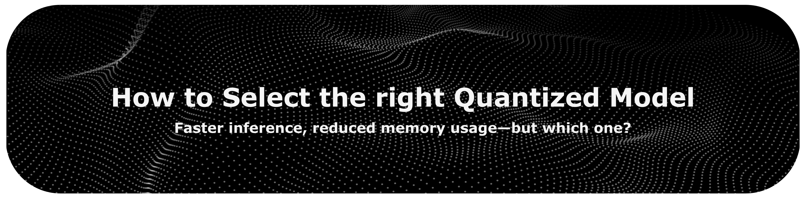
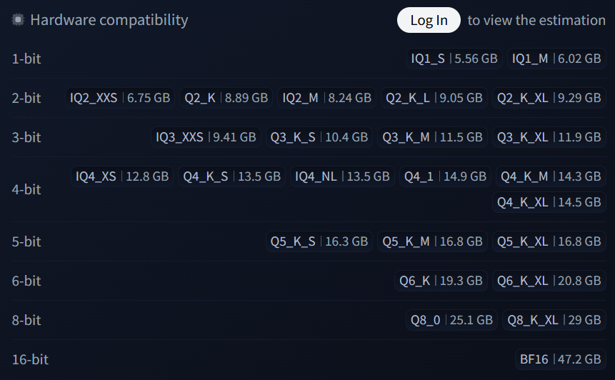

<!-- last-reviewed: 2026-06 -->

 
 

Reading time: ~20 min

 

[Back to the main index](../README.md)

 

# How to Select the Right Quantized Model

This guide explains how to read quantization formats and file names, where to
find trustworthy pre-quantized models, and how to pick the format that fits your
hardware and goal.

 

## Table of Contents

- [Introduction to Quantization](#introduction-to-quantization)
  - [What is Quantization?](#what-is-quantization)
  - [Why Quantize?](#why-quantize)
  - [Common Data Types](#common-data-types)
- [Common Quantization Formats \& Methods](#common-quantization-formats--methods)
  - [GGUF](#gguf)
    - [Decoding GGUF File Names](#decoding-gguf-file-names)
  - [GPTQ](#gptq)
  - [AWQ](#awq)
  - [EXL3 and EXL2](#exl3-and-exl2)
  - [MLX](#mlx)
  - [bitsandbytes](#bitsandbytes)
  - [FP8](#fp8)
  - [Other Methods](#other-methods)
- [Finding Quantized Models: The Providers](#finding-quantized-models-the-providers)
  - [The Hugging Face Hub: Your Primary Destination](#the-hugging-face-hub-your-primary-destination)
  - [Key Community Providers](#key-community-providers)
    - [unsloth](#unsloth)
    - [GGUF, CPU \& Mac Providers](#gguf-cpu--mac-providers)
    - [GPU-Native Providers (EXL3 / EXL2)](#gpu-native-providers-exl3--exl2)
    - [TheBloke (historical)](#thebloke-historical)
- [How to Choose the Right Quantized Model](#how-to-choose-the-right-quantized-model)
  - [Step 1: Assess Your Hardware](#step-1-assess-your-hardware)
  - [Step 2: Define Your Goal](#step-2-define-your-goal)
  - [Decision Matrix](#decision-matrix)
- [Conclusion](#conclusion)

 

## Introduction to Quantization

### What is Quantization?

Quantization in the context of LLMs is the process of reducing the precision of a model's parameters (weights) from a high bit-width (like 32-bit floating point) to a lower bit-width (like 8-bit integers).

Imagine a high-resolution photograph. It contains millions of colors and looks very detailed. If you reduce the number of colors in the image, it will become "grainy" but still recognizable. The file size of the image will be much smaller. Quantization does something similar to LLMs: it reduces the number of "colors" (the precision of the numbers) to make the model smaller and faster, with a minimal loss of quality.

This process involves mapping the original range of floating-point values to a smaller, quantized range. While this introduces a small amount of error (called *quantization error*), the goal is to perform this mapping intelligently to preserve the model's performance as much as possible. This concept is well-explained in "[A Visual Guide to Quantization](https://newsletter.maartengrootendorst.com/p/a-visual-guide-to-quantization)".

### Why Quantize?

The primary benefits of quantization are:

*   **Reduced Memory Footprint**: A 70 billion parameter model in its native 32-bit format (FP32) requires 280GB of memory just to load the weights. Quantizing it to 4-bit can reduce this to around 35GB, making it possible to run on consumer-grade GPUs. Similarly, a more common 8B parameter model goes from over 16GB (FP16) to a much more manageable ~4.5GB as a 4-bit model.
*   **Faster Inference**: Calculations with lower-bit numbers (especially integers) can be significantly faster on modern hardware. This means you get your results from the model more quickly.
*   **Energy Efficiency**: Faster computations and lower memory usage lead to lower power consumption.

### Common Data Types

Here are some common data types you'll encounter when dealing with quantized models:

*   **FP32 (Full Precision)**: The standard 32-bit floating-point format. Most models are trained in FP32.
*   **FP16 (Half Precision)**: A 16-bit floating-point format. It offers a good balance between precision and size, halving the model size compared to FP32.
*   **BF16 (BFloat16)**: Another 16-bit format, popular in deep learning. It has a similar dynamic range to FP32, which can be beneficial for model stability during training and inference.
*   **INT8 (8-bit Integer)**: Represents numbers using 8 bits. This is where significant memory and speed gains are often realized. Quantization to INT8 requires careful mapping from FP32 to minimize accuracy loss.
*   **NF4 (4-bit NormalFloat)**: A 4-bit data type introduced in the QLoRA paper. It's designed to be optimal for normally distributed weights, which is common in LLMs.

 

[Back to top](#table-of-contents)

 

## Common Quantization Formats & Methods

Now, let's dive into the specific formats and methods you'll see when looking for quantized models. Each has its own strengths, weaknesses, and use cases.

### GGUF

GGUF is the model file format used by `llama.cpp`, succeeding the earlier GGML format. It's a container format that stores the model's architecture, vocabulary, and quantized weights in a single file.

*   **Key Feature**: Primarily designed for running LLMs on **CPUs**, although it also has excellent GPU offloading capabilities.
*   **Pros**:
    *   Very easy to use; often works "out of the box".
    *   Great for running models on devices without a powerful GPU (like laptops).
    *   Single file format is convenient.
    *   Supports a wide variety of quantization types.
*   **Cons**:
    *   Can be slower than GPU-native formats if you have a powerful GPU.
*   **Use it when**: You want to run an LLM on your CPU or a Mac with Apple Silicon, or if you have limited VRAM and need to offload some layers to the CPU.

#### Decoding GGUF File Names

When you look for GGUF models, like the ones provided by `unsloth` for `Devstral-Small-2505`, you'll see a variety of cryptic file names like `Q4_K_M`, `IQ4_XS`, or `Q8_0`. These names tell you everything about the quantization level and method. Let's break it down.

 

*A typical selection of GGUF quantizations, as seen on a Hugging Face model card.*

 

**1. Quantization Method: `IQ` vs. `Q`**

*   **`Q` (Standard Quantization)**: This is the original method. It applies a uniform reduction in precision across all the model's weights.
*   **`IQ` (Importance-Matrix Quantization)**: A newer method that uses an importance matrix (imatrix) to preserve the most important weights more carefully during quantization. This gives better quality for the same file size, which matters most at low bit-rates. [Source: `llama.cpp` GitHub Discussions #5962](https://github.com/ggml-org/llama.cpp/discussions/5962)
*   **Rule of Thumb**: At low bit-rates (2-4 bit), prefer an `IQ` quant for the best quality at a given size. The trade-off is that `IQ` quants can be **slower than K-quants on CPU and Apple Silicon**, so if you are running on those and want maximum speed, a K-quant like `Q4_K_M` is often the better pick.

 

**2. Bit-rate: The First Number**

The number after `Q` or `IQ` (`2`, `3`, `4`, `5`, `6`, `8`) indicates the number of bits used per weight.
*   **Lower bit-rate**: Smaller file size, less VRAM usage, faster, but lower quality.
*   **Higher bit-rate**: Larger file size, more VRAM usage, slower, but higher quality.
*   `Q8_0` is a full 8-bit quantization and is very high quality, close to the original `BF16` or `FP16`.
*   4-bit and 5-bit quants usually offer the best balance of performance and size.

 

**3. Variant: The Suffix (`_K_M`, `_XS`, etc.)**

The letters and numbers at the end denote the specific variant of the quantization.

*   **`_K` (K-Quants)**: This is an improved quantization method that uses a larger "codebook" to better represent the weights. K-Quants are generally higher quality than the older, non-K versions.
*   **`_S`, `_M`, `_L`, `_XL`**: These stand for Small, Medium, Large, and Extra Large. They are used with K-Quants (`_K`) to indicate different levels of quantization within that method. `_M` is often the most popular balance. For example, `Q4_K_M` is a 4-bit, K-Quant, Medium variant.
*   **`_XS`, `_XXS`**: These stand for Extra Small and Extra Extra Small, typically used for `IQ` quants. `IQ4_XS` is a very popular and high-quality 4-bit option.
*   **`_0`, `_1`**: These are older legacy variants. For example, `Q4_0` is a basic 4-bit quant, generally lower quality than `Q4_K_M`.

 

**4. Provider-Specific Enhancements**

You may also see prefixes or additional tags added by specific providers. For example, Unsloth uses `UD` in their filenames (e.g., `...-UD-IQ2_XXS.gguf`) to denote their **Unsloth Dynamic** quantization, which is an advanced, model-specific quantization method.

 

**Recommendations:**

| VRAM / Goal           | Recommended GGUF Quants                 | Why                                                                       |
| --------------------- | --------------------------------------- | ------------------------------------------------------------------------- |
| **Max Quality**       | `Q8_0`, `Q6_K`                          | Closest to the original model, but requires significant VRAM.             |
| **Best Balance**      | `Q5_K_M`, `IQ4_XS`, `Q4_K_M`            | Excellent balance of performance and resource usage. A great starting point. |
| **Low VRAM / Speed**  | `IQ3_XXS`, `Q3_K_M`                     | Usable on systems with very limited resources, but quality will be lower.   |
| **Experimental/Tiny** | `IQ2_XXS`, `Q2_K`                       | Very small and fast, but expect a significant drop in coherence and quality. The model may be more prone to repetition, hallucination, or losing the plot in conversation. |

By understanding these components, you can look at a list of GGUF files and make an informed decision based on your hardware and performance needs.

 
 

### GPTQ

GPTQ (Generative Pre-trained Transformer Quantization) is a popular Post-Training Quantization (PTQ) algorithm. It analyzes the model's weights layer by layer to quantize them with minimal performance loss.

*   **Key Feature**: Aims for high accuracy at low bit-rates (typically 3, 4, or 8-bit) and is optimized for **GPU inference**.
*   **Pros**:
    *   Excellent performance (low perplexity, a measure of how well a model predicts text; lower is better) for the file size.
    *   Fast inference speed on GPUs.
*   **Cons**:
    *   The quantization process itself can be slow and memory-intensive.
    *   Less flexible than GGUF; primarily for NVIDIA GPUs.
    *   Can sometimes struggle with models that are not standard transformer architectures.
*   **Use it when**: You have a decent NVIDIA GPU and want to run a model with good speed and accuracy.

 

### AWQ

AWQ (Activation-aware Weight Quantization) is another PTQ method that improves upon GPTQ. It recognizes that not all weights are equally important. By analyzing the activation scales, AWQ selectively preserves the precision of more important weights.

*   **Key Feature**: Protects salient weights to maintain model quality, allowing for accurate 4-bit quantization. Optimized for **GPU inference**.
*   **Pros**:
    *   Often provides better performance than GPTQ at the same bit-rate.
    *   Very fast inference speeds.
*   **Cons**:
    *   Primarily for NVIDIA GPUs.
*   **Use it when**: You want strong 4-bit accuracy for GPU inference. AWQ is now one of the most widely used formats in GPU serving engines such as vLLM and SGLang.

 

### EXL3 and EXL2

These are the quantization formats for the ExLlama inference engines. **EXL3** is the current format, used by [`exllamav3`](https://github.com/turboderp-org/exllamav3); **EXL2** is the previous format, used by `exllamav2`. Both target fast inference and low VRAM on NVIDIA GPUs, and both use a flexible, variable bit-rate scheme — you'll see files labelled with an average bit-rate such as `4.5bpw` or `6.0bpw` rather than a fixed `Q4`.

EXL3 is a redesign based on the QTIP quantization method. It delivers noticeably better quality per bit than EXL2 (a 3-bit EXL3 model is roughly comparable to a 4-bit EXL2 one), quantizes in a single step, and preserves the model's original tensor structure, which makes wider support (such as in Transformers) more feasible over time.

*   **Key Feature**: Highly optimized for speed on **NVIDIA GPUs**, with variable bit-rates that preserve more detail in important layers.
*   **Pros**:
    *   Among the fastest local inference methods available.
    *   Very low VRAM usage; EXL3 improves quality-per-bit further, making low bit-rates more usable.
*   **Cons**:
    *   Tied to the ExLlama ecosystem (and modern NVIDIA GPUs).
*   **Use it when**: Your top priority is raw inference speed on an NVIDIA GPU. Prefer **EXL3** for new setups; use EXL2 if a model you need is only available in that format.

 

### MLX

MLX is a machine learning framework designed by Apple, specifically for Apple Silicon. MLX models are quantized models optimized to run efficiently on the unified memory and Neural Engine of M-series chips.

*   **Key Feature**: The native, most performant format for running models on **Apple Silicon (Macs)**.
*   **Pros**:
    *   Best performance and efficiency on Apple Silicon (M1-M4).
    *   Leverages Apple's hardware (GPU, Neural Engine) seamlessly.
    *   Growing ecosystem with providers like `mlx-community`.
*   **Cons**:
    *   Specific to Apple hardware.
*   **Use it when**: You are using a Mac with Apple Silicon and want the best possible performance.

 

### bitsandbytes

`bitsandbytes` is not a model format like GGUF, but a library that provides on-the-fly quantization. It's famous for its role in QLoRA, which enables fine-tuning of quantized models.

*   **Key Feature**: Performs quantization dynamically as the model is loaded. Provides `LLM.int8()` and 4-bit `NF4` quantization.
*   **Pros**:
    *   Enables fine-tuning of huge models on consumer hardware (QLoRA).
    *   Easy to integrate into existing Hugging Face workflows.
*   **Cons**:
    *   Can be slower for pure inference compared to pre-quantized formats like GPTQ or EXL2.
*   **Use it when**: You want to fine-tune a large model, or when you want an easy way to load a model in 8-bit or 4-bit without looking for a pre-quantized version.

 

### FP8

FP8 (8-bit floating point) is a quantization format aimed at **GPU serving**. Unlike integer formats, it keeps a floating-point representation (commonly the `E4M3` variant), which maps cleanly onto the FP8 hardware units in recent NVIDIA GPUs (Hopper, Ada, and Blackwell) and on recent AMD data-center GPUs.

*   **Key Feature**: Near-lossless 8-bit quality with hardware-accelerated throughput on modern server GPUs.
*   **Pros**:
    *   Very small quality loss compared to FP16/BF16.
    *   High throughput in serving engines such as vLLM, SGLang, and TensorRT-LLM.
*   **Cons**:
    *   Needs recent GPU hardware to get the speed benefit; little advantage on older cards.
    *   An 8-bit format, so it saves less memory than 4-bit options.
*   **Use it when**: You are serving a model on recent server-class GPUs and want quality close to the original with good throughput. This pairs naturally with the serving engines covered in [How to Run LLMs on Your Machine](how-to-run-llms-on-your-machine.md#llamacpp).

 

### Other Methods

The field moves quickly, and you may come across newer methods aimed at better accuracy at low bit-rates or faster quantization:

*   **AutoRound** (Intel): a post-training method using sign-gradient descent that achieves strong accuracy at 2-4 bit, and can export to GGUF, GPTQ, and AWQ.
*   **HQQ** (Half-Quadratic Quantization): a fast, calibration-free method that quantizes large models in minutes without a calibration dataset.
*   **compressed-tensors**: a flexible container format (from the vLLM ecosystem) that stores FP8, INT8, INT4, and sparse models, increasingly used to distribute server-ready quantized models on the Hub.

For most local use you will still pick one of the main formats above; these are worth knowing as they appear more often on the Hub.

 

[Back to top](#table-of-contents)

 

## Finding Quantized Models: The Providers

You rarely have to quantize a model yourself. Several individuals and groups consistently publish pre-quantized models on platforms like Hugging Face, usually within hours or days of a new release.

### The Hugging Face Hub: Your Primary Destination

The [Hugging Face Hub](https://huggingface.co/models) is the central repository for almost all open-source models. When a new model is released, you can almost guarantee that quantized versions will appear within hours or days.

**How to find them:**

1.  Search for the base model you're interested in (e.g., "Llama-3-8B-Instruct").
2.  Look for community versions by filtering by "Community" on the left panel.
3.  Often, you will find models with format names in the title, like "Llama-3-8B-Instruct-GGUF" or "Llama-3-8B-Instruct-GPTQ".

 
 

### Key Community Providers

The set of providers evolves over time: some names become trusted sources for a wide range of models, while new specialists emerge with new releases or formats. For example, a search for the `mistralai/Devstral-Small-2505` model reveals quantizations from a diverse group of contributors. Here are the key players you'll frequently encounter.

 

#### **unsloth**

[**unsloth**](https://huggingface.co/unsloth) is a team that has rapidly become a key provider, focusing on creating high-performance models and the tools to run them. Beyond just quantizing, they are deeply involved in the ecosystem, often contributing critical bug fixes to the original model repositories for issues related to accuracy, chat templates, and stability.

*   **Specialty**: **High-Performance GGUFs & Fine-Tuning**.
    *   **Unsloth Dynamic GGUFs**: Unsloth has developed an advanced quantization method they call "Dynamic GGUFs". Instead of using a one-size-fits-all approach, this method intelligently analyzes each model and custom-tailors the quantization layer by layer.
    *   **Performance**: According to their own benchmarks, these dynamic quants can outperform standard `imatrix` GGUFs and even the original provider's Quantization-Aware Training (QAT) models on benchmarks like MMLU, while being smaller in file size. They advocate for using KL Divergence as a more accurate measure of quantization quality over perplexity. [Source: Unsloth Documentation](https://docs.unsloth.ai/basics/unsloth-dynamic-2.0-ggufs).
    *   **Fine-tuning**: They provide an optimized library that dramatically speeds up fine-tuning (2-5x faster) and reduces memory usage, making it possible to fine-tune larger models on consumer GPUs.

*   **Use them when**: Your goal is to fine-tune a model, or you want a GGUF that is potentially more performant and meticulously optimized than a standard GGUF. Look for `UD` in their GGUF filenames.

 

#### GGUF, CPU & Mac Providers

Several contributors focus on providing GGUF models, which are excellent for CPU and Apple Silicon users.

*   [**bartowski**](https://huggingface.co/bartowski): A consistent and reliable provider of GGUF models for new releases.
*   [**mradermacher**](https://huggingface.co/mradermacher): One of the most prolific GGUF providers, offering both static and weighted/imatrix (`i1`) quants across a very wide range of models. A go-to source since TheBloke wound down.
*   [**lmstudio-community**](https://huggingface.co/lmstudio-community): Provides GGUF and is also a key source for **MLX** formats, which are specifically optimized for Apple Silicon.
*   [**mlx-community**](https://huggingface.co/mlx-community): As the name suggests, this group focuses on providing the community with MLX-quantized models for Macs.

 

#### GPU-Native Providers (EXL3 / EXL2)

For maximum inference speed on NVIDIA GPUs, the EXL3 and EXL2 formats are a top choice.

*   [**ArtusDev**](https://huggingface.co/ArtusDev) and [**matatonic**](https://huggingface.co/matatonic): Community members who specialize in high-quality EXL3 and EXL2 quantizations, often offering a wide range of bit-rates for the latest models.

 

#### **TheBloke** (historical)

For a long time, [**TheBloke**](https://huggingface.co/TheBloke) was the most prolific and trusted provider of quantized models, with a massive library of GGUF, GPTQ, AWQ, and EXL2 files. He has not published new quants since early 2024, so the repository is best treated as an archive for older, foundational models — for current releases, use the providers above.

 

[Back to top](#table-of-contents)

 

## How to Choose the Right Quantized Model

The right choice depends on your hardware, your VRAM, and your goal.

### Step 1: Assess Your Hardware

*   **Powerful NVIDIA GPU (e.g., RTX 3090, 4090, 5090)**: You have the most options. You can run high bit-rate EXL3, AWQ, or GPTQ models for maximum quality and speed.
*   **Mid-range/Low VRAM NVIDIA GPU (e.g., RTX 3060 12GB, RTX 5060)**: You need to be mindful of VRAM. 4-bit or 5-bit models in EXL3, GPTQ, or AWQ formats work well. For larger models, you might need GGUF with GPU offloading.
*   **CPU-only or Laptop**: Your best, and often only, choice is **GGUF**, which runs well on CPUs.
*   **Apple Silicon (Mac, M1-M4)**: Your best options are **GGUF** (via `llama.cpp`) or the native **MLX** format. The shared (unified) memory means your whole system RAM is available to the model.
*   **AMD GPU**: Support for ROCm (the AMD equivalent of CUDA) is improving, but can still be tricky. The most reliable path is often **GGUF** with GPU offloading, which is well-supported.

### Step 2: Define Your Goal

*   **I just want the fastest possible inference**: **EXL3** is likely your best bet, if you have a compatible NVIDIA GPU.
*   **I want to fine-tune the model**: Use a `bitsandbytes` NF4 model, ideally with the **Unsloth** library.
*   **I want an easy, "it just works" experience**: **GGUF** is the simplest to get started with across the widest range of hardware.
*   **I want a good balance of speed and accuracy on my GPU**: **AWQ** and **GPTQ** are the standard choices. AWQ often has a slight edge in accuracy.
*   **I'm serving a model to many users on a server GPU**: **FP8** (near-lossless) or **AWQ** in an engine like vLLM or SGLang.

### Decision Matrix

Here is a simple table to help you decide:

| Hardware                | Goal                                   | Recommended Format(s)          | Key Provider/Tool                                |
| ----------------------- | -------------------------------------- | ------------------------------ | ------------------------------------------------ |
| **NVIDIA GPU**          | Max Inference Speed                    | EXL3 (EXL2)                    | ArtusDev, matatonic                              |
|                         | Balanced Speed/Accuracy                | AWQ, GPTQ                      | Search the Hub for the model name                |
|                         | Server / High Throughput               | FP8, AWQ                       | vLLM, SGLang (search the Hub)                    |
|                         | Fine-Tuning                            | `bitsandbytes` (NF4) + QLoRA   | unsloth, Hugging Face                            |
|                         | Low VRAM / Large Model                 | GGUF (with GPU offload)        | bartowski, mradermacher, unsloth                 |
| **CPU**                 | All tasks (Inference)                  | GGUF                           | bartowski, mradermacher, lmstudio-community      |
| **Apple Silicon (Mac)** | All tasks (Inference)                  | GGUF, MLX                      | bartowski, mlx-community, lmstudio-community     |
| **AMD GPU**             | All tasks (Inference)                  | GGUF (with GPU offload)        | bartowski, mradermacher                          |

 

## Conclusion

Quantization is a powerful technique that makes large language models accessible to a wider audience. By reducing the memory and computational requirements of these models, developers and enthusiasts can run them on consumer-grade hardware.

Understanding the landscape of quantization formats—from the CPU-friendly **GGUF** to the GPU-optimized **GPTQ**, **AWQ**, and **EXL3**—is the first step. The second is knowing where to find them, which a steady community of providers makes straightforward.

The best quantized model for you depends on your specific circumstances. By considering your hardware and your primary goal, you can use the guidance in this tutorial to navigate the options and select a model that fits your needs.

 

[Back to top](#table-of-contents)

 
