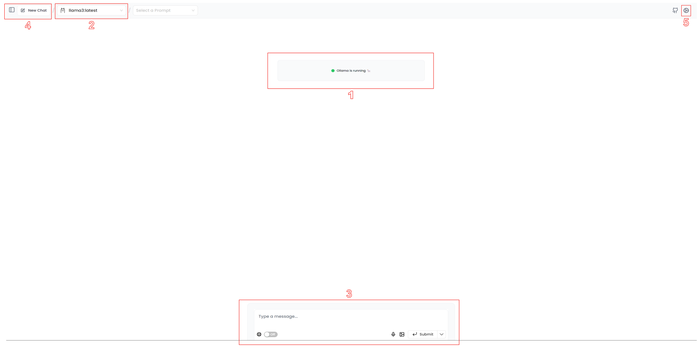

# LLM, Just for You: A Practical Tutorial to Run a Local Model

## Introduction (***Sorry for the long intro***)

This tutorial is designed for individuals seeking greater control and transparency in their data processing, regardless of their background or expertise. I will provide a step-by-step guide on how to set up a local LLM environment using Ollama as the backend and Page Assist extension in your browser.

### 🔴 The Privacy and security issue of Cloud based LLM services

Using Large Language Model (LLM) services online can raise significant privacy concerns. When you rely on cloud-based LLMs, your data is stored and processed by third-party providers, which can lead to unintended consequences. Your input data may be shared with other users or used for purposes beyond what you initially intended. Additionally, the algorithms used to train these models are often complex and opaque, making it difficult to understand how your data is being processed and potentially leading to biased or discriminatory outcomes. Furthermore, the sheer scale of cloud-based LLMs means that even minor issues can result in massive data breaches, compromising the privacy and security of countless users

### 🟢 Control in Your Hands: Advantagesof Running LLM Models Locally

Running Large Language Model (LLM) models locally offers several advantages, particularly in terms of privacy and control. By processing data on your own machine, you can ensure that your input data remains confidential and is not shared with third-party providers. This also allows you to maintain complete control over the model's training and deployment, ensuring that it aligns with your specific goals and objectives. Additionally, running LLM models locally enables faster processing times and reduced latency, making it ideal for applications where real-time feedback is essential. Furthermore, by keeping your data and model on-premises, you can avoid potential issues related to data sovereignty, such as data localization requirements and regulatory compliance.

## Step 1 : Install and Setup Ollama

### Installation

| Platform          | Installation Method |
|:-----------------:|:--------------------:|
| **macOS**         | [Download](https://ollama.com/download/Ollama-darwin.zip) |
| **Windows** | [Download](https://ollama.com/download/OllamaSetup.exe)  |
| **Linux**          | [Manual install instructions](https://github.com/ollama/ollama/blob/main/docs/linux.md) |
| **Docker**         | [Ollama Docker image](https://hub.docker.com/r/ollama/ollama) is available on Docker Hub.  |

### Quickstart

To run and chat with [Llama 3](https://ollama.com/library/llama3) write the following input in a terminal:

```
ollama run llama3
```
This will allow you to chat with the **llama3:8B model** within the command-line interface (CLI). See the list of models available on [ollama.com/library](https://ollama.com/library 'ollama model library').

> [!Note]
> You should have at least 8 GB of RAM available to run the 7B models, 16 GB to run the 13B models, and 32 GB to run the 33B models.
> Depending on your hardware specifications The model might take a long time to generate text or process requests.

## Step 2 : Use Ollama in your browser using Page assist extension.

It is not comfortable working directly in the command-line interface (CLI) for most, so i will show you how to interact with your Ollama model using a browser-based interface. We will be using the [Page assist extension](https://github.com/n4ze3m/page-assist).

Page Assist is an open-source Chrome Extension that provides a Sidebar and Web UI for your Local AI model. It allows you to interact with your model from any webpage.

### Installation

You can install the extension from the [Chrome Web Store](https://chromewebstore.google.com/detail/page-assist-a-web-ui-for/jfgfiigpkhlkbnfnbobbkinehhfdhndo)

> [!Note]
> You can install the extension on any Chromium-based browser. It is not limited to Chrome.
> Other type of browser support is planned.

If needed, see the [Manual Installation](https://github.com/n4ze3m/page-assist) instructions on their github repository.

### Usage

Now that you've got the extension installed, you can easily access your Ollama models from anywhere in your browser. Just click on the extension icon and it'll take you straight to the Web UI page.

<p align="center">
  <br>
    
 <br>
</p>

* **1. The Running Indicator** : A center message letting you know that Ollama is running in the background, ready to handle your requests.
* **2. Model Selection Toggle** : A list of all the models you've installed and are available for use. Select the model you want to discuss with.
* **3. Input Box** : This is where the magic happens! Type away (or upload images with multimodal models like LLava) to start a conversation with your model.
* **4 Conversation Management**: Keep track of your different conversations or create new ones.
* **5 Settings Access**: Need to tweak some settings? You'll find the access point for that here.

> [!Note]
> When you first interact with your model, there might be a brief delay as it loads into memory. But once you're chatting away, responses should come quickly !
> Just remember that processing time can vary depending on your computer's specs.
